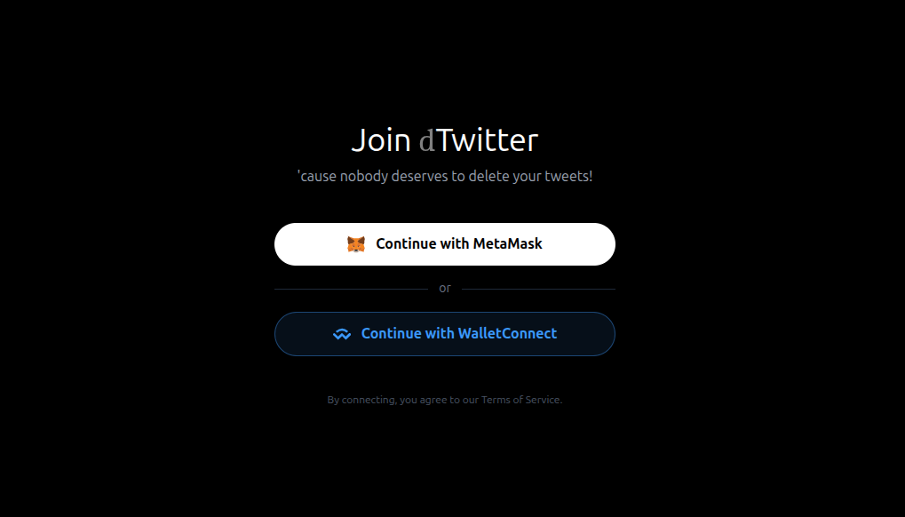
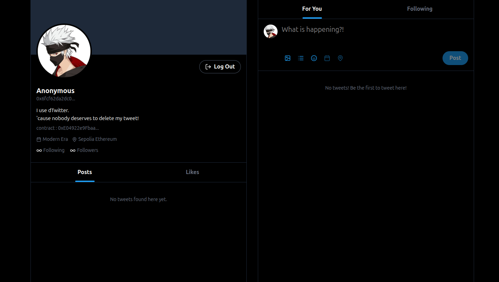

<h1 align="center">deTwitter</h1>

<p align="center">
  decentralized social media app.
  <br/>
  'cause nobody deserves to delete your tweet!
</p>

<p align="center">
  <a href="https://de-twitter.netlify.app/">
    
  </a> <a href="https://etherscan.io/address/0xE04922e9Fbaa53736436EF60C474546f249B714b">
    
  </a>
</p>

<p align="center">
  
</p>




<br />

## Guide to Clone

```bash
git clone https://github.com/itushh/de-twitter

cd dtwitter

npm install

npm run dev
```
<br />

## Features

- **Wallet is your identity**  
  No emails. No passwords. If you lose your wallet, that’s on you.

- **Tweets etched on-chain**  
  Not stored. Not cached. Literally written into the blockchain like a digital tattoo.

- **Censorship? Never heard of it**  
  No admin panel. No hidden delete button. Nobody is coming to “moderate” you.

- **Immutable everything**  
  Once it’s out, it’s out. No edits. No take-backs. Regret is a feature.

- **Trustless interactions**  
  No middlemen deciding what’s real. Code runs the show.

- **You own your content**  
  Not the platform. Not some corporation. You.

- **Zero safety nets**  
  Post something dumb → it lives forever. Think before you flex.

<br />

## Vision

Build a social platform with true freedom of speech.

Yes, nonsense will exist. but that’s reality.  
People say nonsense. Hiding it doesn’t fix it.

The goal isn’t to silence voices, but to let truth compete openly.  
Let people judge. Let ideas stand or collapse on their own.

Freedom here is real.  
So are the consequences.

Note :- Not a crazy invention, just learning web3.

---
<br />

<p align="center">
  <a href="https://your-site.com">
    
  </a>
</p>